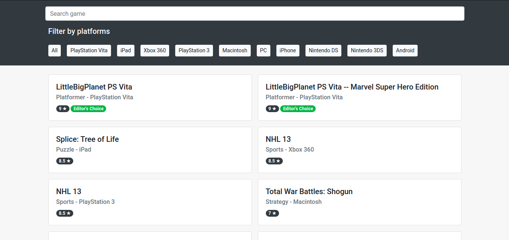

# Game Arena

Pure Vanilla JavaScript webapp with searching filtering functionality with responsive UI.

## Table of contents

- [Overview](#overview)
  - [The challenge](#the-challenge)
  - [Screenshot](#screenshot)
  - [Links](#links)
- [Author](#author)

## Overview

### The challenge

Users should be able to:

- View the fetched data
- Filter the data by different platforms
- Search by title

### Screenshot

### Links

- Live Demo URL: [Click here to view](https://sushil333.github.io/frontend-mentor/game-arena/)

### Useful resources

- [W3School](https://www.w3schools.com/) - It has almost all the information about HTML, CSS, & JS.

## Author

- Website - [sbrocks.me](https://www.your-site.com)
- Frontend Mentor - [@Sushil333](https://www.frontendmentor.io/profile/Sushil333)
